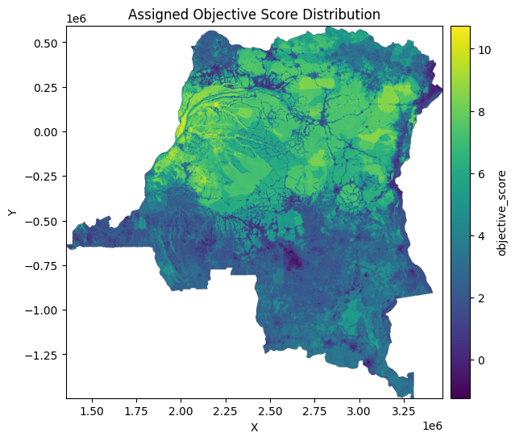

# 30 x 30 Spatial Planning Toolbox for the Democratic Republic of Congo (DRC)
This repository contains the code for a spatial planning to tool to support implementation of the 30 x 30 initiative targets in the Democratic Republic of Congo (DRC). Specifically, this tool utilizes several geospatial datasets to find the most spatially optimized scenario for protecting new areas within DRC to meet the 30 x 30 target. 
The tool is built based on a dataset developed at spatial planning units of 1 km x 1 km. For each planning unit, a set of variables are calculated from existing products (e.g. above ground biomass). Existing protected areas are also mapped to the 1 km x 1 km grid, and they are input as constraints to the model.

<div align="center">
    
</div>

## Requirements
### Software
This toolbox is developed in Python. To ensure reproducibility of results, the tool is wrapped in a Docker environment. To run the code locally, you need to install [Docker](https://www.docker.com/products/docker-desktop/) for free and follow the instructions below. 

If you are running this on Windows, it's recommended to run it inside Windows Subsystem for Linux (WSL). Follow the instructions [here](https://learn.microsoft.com/en-us/windows/wsl/install) to enable WSL in your Windows. 

### Data
The input data to this tool is a CSV file containing all the required variables derived from products available on Google Earth Engine (GEE). The CSV file should be added to the local directory of the project for the code to execute. You can use the tool implemented [here](https://github.com/ClarkCGA/drc_30x30_data_prep) to generate the CSV file. 

## Configurations
The file `config.yml` stores all the parameters that are used in the toolbox. These include name of the CSV input file and name of all variables used for optimization. Other parameters include the weight of each variable in the optimization function, and list of variables that should be used as constraint in the optimization. 

## Instructions

### 1. Clone the Repository

```bash
git clone git@github.com:ClarkCGA/drc_30x30_opt.git
cd drc_30x30_opt
```

### 2. Build the Docker Image

```bash
docker build -t drc-30x30-opt .
```

### 3. Run the Docker Container

```bash
docker run -it -p 8888:8888 -v $(pwd):/app drc-30x30-opt
```
This will print out the URL to the Jupyter Lab (including its token). Copy the URL, and paste into a browser to launch Jupyter Lab. 

### 4. Execute the Tool 

Open Jupyter notebook `main_opt.ipynb`


## Acknowledgements
This project is funded by the Wildlife Conservation Society (WCS) through a contract with Clark CGA. 

## Support
If you run into any issues running this code, or if you have questions about it you can open a ticket on this GitHub repository or contact Clark CGA team at `cga@clarku.edu`.